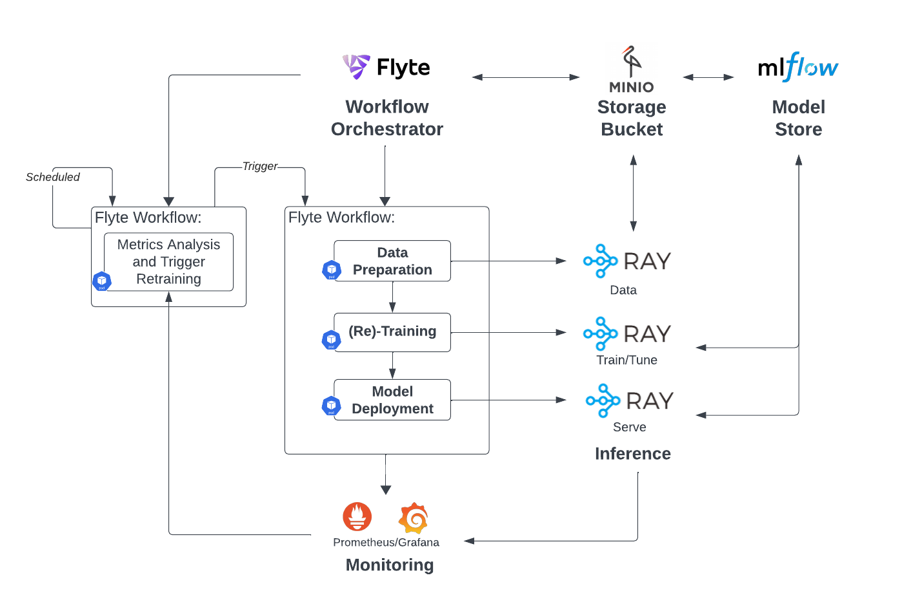

# Self-Evolving AI/ML Workflow

Our system is managed by ArgoCD, all changes to conf/kube_conf will be picked up by Argo and can be synced manually or automatically to our cluster.

If running on a different VM, IPs are currently hardcoded in example flyte workflow and need to be changed: `flyte-projects/mnist/workflows/*`
Number of replicas and resources for Ray should be adjusted for the specific infrastructure in `conf/kube_conf/ray/ray-serve.yaml` and applied to the cluster using kubectl.

### Minimal requirements:
12 CPUs
32GB RAM

### To recreate our system:
- Use at least one node with Ubuntu installed (Tested with 22.04.1-Ubuntu).
- Clone the repo.
- Run install script `./scripts/system-install.sh` which installs microk8s and argocd and automatically deploys all our apps on the cluster.
- (Optional) Run install script `scripts/rasp-install.sh` on any raspberry pi node you want to join to the cluster.
- Run config script `./scripts/env-prepare.sh` on VM to install requirements and connect flytectl to the cluster for running pipelines. This can be run from a different machine (Not tested).

> Scripts should be run from root of repository.
> For scripts to work entire conf/ folder needs to be included
> If any of the scripts fail, they should be run line by line to debug the problem.

- Adjust ray resources and replicas in `conf/kube_conf/ray/ray-serve.yaml` if needed and apply it to the cluster using kubectl.
- Adjust IPs in Flyte workflow files.

### In short:
```bash
git clone https://github.com/copandrej/IJS-AI_orchestration.git && cd IJS-AI_orchestration/
./scripts/system-install.sh
./scripts/env-prepare.sh
```

## Project
`scripts/`
Install & configure scripts for the system

`flyte-projects/`
Examples of full MLOps pipelines

`conf/`
Yaml files for kubernetes and software running on kubernetes. Single source of truth for ArgoCD

`docker/`
Centralized dockerfiles and building scripts. TBC.

## Architecture


